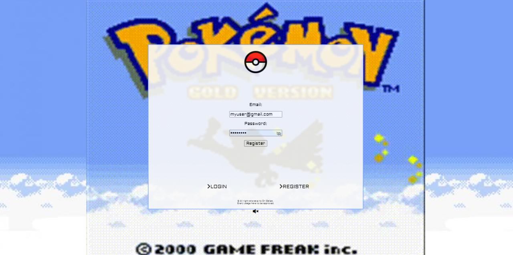
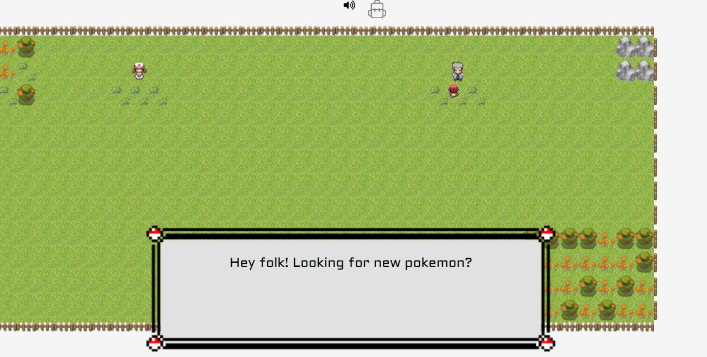
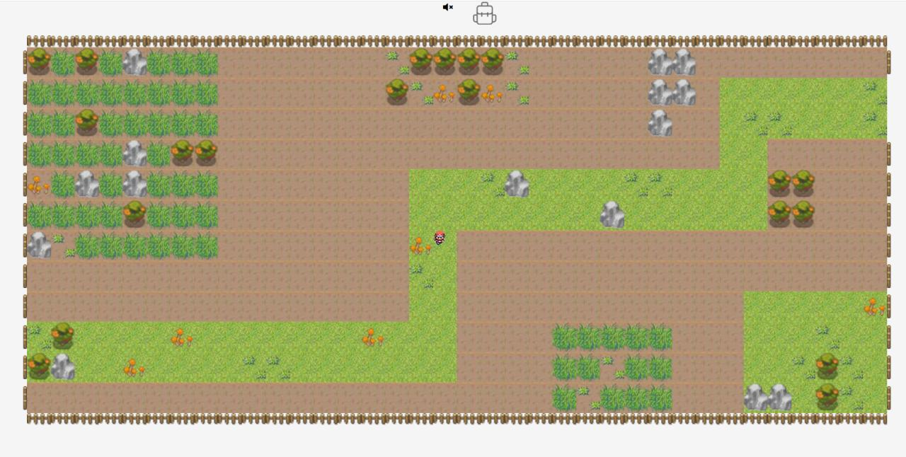
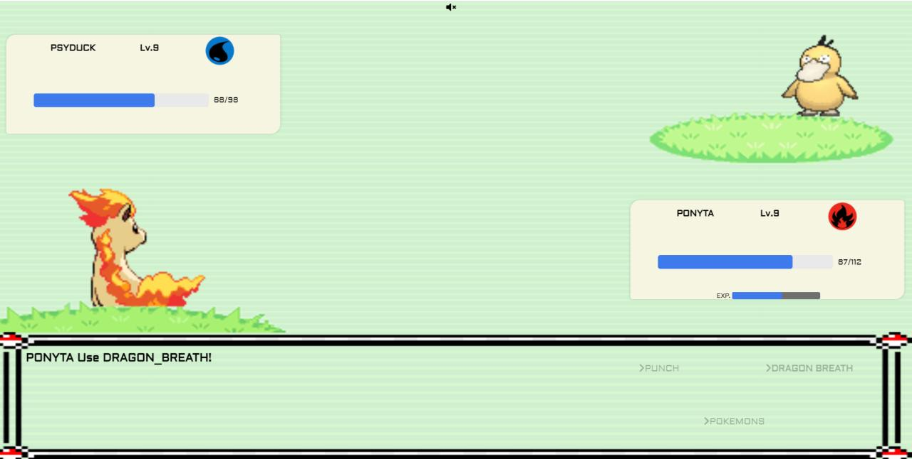

Web game base on classic "Pokemon" the gameboy game. The user got character that can travel the world, battle enemies pokemons, level up, gain money and buy new pokemons. User data stored in database.
Advanced work with classes, render flow, sounds, sprites, animations, RPG game formulas, data and algorithms.

Landing

Landing form - login/register.

Town

In the town the user can chat with character and buy pokemons or restore lost hp points

Forest

User character travel the the world using keyboard In the forest, the user got a chance to meet an enemy if step in the bushes

Battle

Battle section. Alot of animations, manage both in-battle functions(calculate hit/miss, damage and defense consider types and pokemon stats) and after-battle (exp gain, health lost, api call..) .